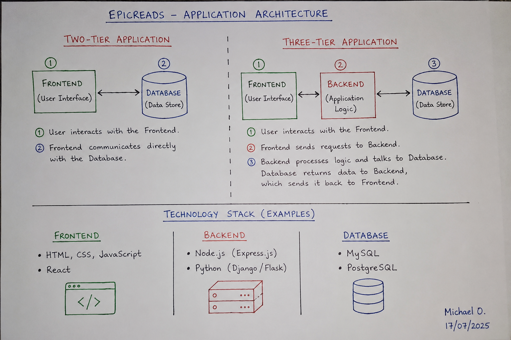

# Week 00 - Internet and Networking

Part of the DevOps Micro Internship (DMI) Cohort 3 with Agentic AI

---

# 🧑‍💻 Task 1: Using ChatGPT as Your Learning Assistant

## Scenario

You're new to DevOps and will frequently encounter technical questions. ChatGPT can be your learning companion.

## Your Task

Write a clear ChatGPT prompt to help you understand:

> "What is a protocol in networking? Explain with a simple real-life example."

Take a screenshot of your interaction showing:

* Your detailed prompt (with clear expectations)
* ChatGPT's simplified response with an example

## Screenshot

Save your screenshot in the `screenshots` folder and update the file name below.


Replace `task-1-chatgpt.png` with your actual screenshot file name.

---

## What I Learned (2–3 lines)

Add your answer here...

---

# 🌐 Task 2: Internet and Networking

## Scenario

Your friend is launching an online bookstore named **EpicReads**.

He asked you to explain how users globally can access his website hosted in Finland.

## Your Task

Write a short explanation (**100–150 words**) that includes:

* Packet Switching
* IP Address
* TCP/IP
* HTTP/HTTPS

💡 **Tip:** You may use ChatGPT (as demonstrated in Task 1) to refine your explanation.

## Answer

Add your answer here...

---

# 🏗️ Task 3: Application Architecture & Stack

## Scenario

EpicReads bookstore has two application versions:

### Two-Tier Application

* Frontend
* Database

### Three-Tier Application

* Frontend
* Backend
* Database

## Your Task

* Draw simple diagrams (hand-drawn or tool-based such as draw.io)
* Label each layer clearly
* List at least two common technologies or tools used for each layer
* Submit a screenshot or photo clearly showing your own drawing

## Diagram Screenshot / Photo

Save your diagram image in the `screenshots` folder and update the file name below.




Replace `task-3-diagram.png` with your actual diagram file name.

---

## Technologies Used

### Frontend

* HTML, CSS and JavaScript
* React

### Backend

* Node.js
* Express.js

### Database

* MYSQL
* PostgreSQL

---

# 🌍 Task 4: Domain Name & DNS (Basic Concepts)

## Scenario

Your friend's bookstore **EpicReads** is currently accessible through:

```text
52.172.142.222:3000
```

He purchased the domain:

```text
epicreads.com
```

## Your Task

In **50–100 words**, explain in your own words:

1. What is DNS (Domain Name System)?
2. Which DNS record type should be used to connect the domain to the given IP, and why?

## Answer

The Domain Name System (DNS) is like the internet's phonebook. It translates an easy-to-remember domain name such as epicreads.com into an IP address that computers use to locate a server. To connect the domain to the server with IP address 52.172.142.222, an A record should be used because it maps a domain name directly to an IPv4 address. This allows users to access the website using the domain instead of typing the IP address.

---

# 💻 Task 5: Visual Studio Code Setup (Hands-on)

## Your Task

Install Visual Studio Code (if not already installed).

Take a screenshot of your VS Code environment showing:

* Terminal open inside VS Code
* Running a basic command:

### Windows

```powershell
dir
```

### Linux / macOS

```bash
pwd
ls
```

* Your selected VS Code theme clearly visible

⚠️ **Important:** The screenshot must show your username or another identifiable detail to confirm it is your environment.

## Screenshot

Save your screenshot in the `screenshots` folder and update the file name below.


Replace `task-5-vscode.png` with your actual screenshot file name.

---

# 🔗 Task 6: Publish Your Assignment as a LinkedIn Post

## Objective

Publishing on LinkedIn helps you:

* Build your professional online presence
* Reinforce your learning
* Document your DevOps journey publicly

## Your Task

Summarize your answers from Tasks 1–5 into a LinkedIn post.

Clearly structure your post into the following sections:

* ChatGPT
* Internet & Networking
* App Architecture
* DNS
* VS Code Setup

Add the following credit note at the end of your post:

> **P.S. This post is a part of DevOps Micro Internship with Agentic AI Cohort-3 by Pravin Mishra. You can start your DevOps journey by joining this Discord community: https://discord.pravinmishra.com/**

---

## LinkedIn Post URL

Paste your LinkedIn post URL here:

`https://www.linkedin.com/posts/michael-okanlawon_devops-micro-internship-dmi-by-pravin-activity-7442557463683313664-Z0BJ?utm_source=share&utm_medium=member_desktop&rcm=ACoAAC9A9-IBmPTPhzYSqhRaCI1i6ENsTRA8KEw`

---

## LinkedIn Post Backup Copy

Paste the full text of your LinkedIn post here:

🚀 DevOps Micro Internship – Week 0 Assignment Completed
As part of my DevOps learning journey, I completed the Week-0 assignment covering basic concepts in networking, application architecture, DNS, and development environment setup. 

Here is a summary of what I learned:
🔹 ChatGPT
Used ChatGPT as a learning assistant to understand networking concepts.
 I created a clear prompt to learn what a network protocol is, and received a simplified explanation with a real-life example.
 This helped me see how AI can be used as a study companion while learning DevOps.

🌐 Internet & Networking
I explained how users around the world can access a website hosted in another country.
 Key concepts used:
Packet Switching – breaks data into small packets sent across the internet
IP Address – unique identifier for devices on the network
TCP/IP – ensures reliable communication between devices
HTTP / HTTPS – protocol used to load websites (HTTPS adds encryption for security)
Together, these technologies make global internet communication possible.

🏗 App Architecture
Learned the difference between Two-Tier and Three-Tier application architecture.
Two-Tier
 Frontend + Database
Three-Tier
 Frontend + Backend + Database
Examples of technologies:
Frontend: HTML, CSS, JavaScript
Backend: Node.js, Python, Java
Database: MySQL, PostgreSQL, MongoDB
This helped me understand how real-world applications are structured.

🌍 DNS
DNS (Domain Name System) translates domain names into IP addresses.
 Example: epicreads.com → 52.172.142.222
To connect a domain to an IP address, an A record is used.
 This allows users to access a website using a name instead of numbers.

💻 VS Code Setup
Installed Visual Studio Code and practiced using the built-in terminal.
 Ran basic commands to verify the setup:
dir (Windows)
pwd / ls (Linux / Mac)
This step is important for working with code, scripts, and DevOps tools.

P.S. This post is part of the FREE DevOps Micro Internship Cohort run by Pravin Mishra(https://lnkd.in/dvFWkr2y). You can start your DevOps journey for free from his YouTube Playlist (https://lnkd.in/dreweTQc).

---

# Reflection – Week 0

### What did you find easy?

I found it easy to understand the basic networking concepts and complete the VS Code setup. Learning about protocols, DNS, and application architecture was straightforward with the help of examples.

---

### What was difficult?

The most difficult part was understanding how all the networking components work together behind the scenes, especially packet switching and TCP/IP. I had to read through the concepts more than once before they became clear.

---

### What will you improve next week?

Next week, I will spend more time practicing instead of only reading. I also plan to improve my understanding of DevOps fundamentals by completing more hands-on exercises and asking questions whenever I get stuck.

---

## 📌 About DMI & CloudAdvisory

DevOps Micro Internship (DMI) is a project-based DevOps program run by Pravin Mishra (The CloudAdvisory) focused on real-world execution, systems thinking, and career readiness.

It helps learners build strong DevOps foundations with hands-on experience.


## 📌 Resources

- 🌐 **DMI Official Website:** https://pravinmishra.com/dmi  
- 🎓 **DevOps for Beginners (Udemy):** https://www.udemy.com/course/devops-for-beginners-docker-k8s-cloud-cicd-4-projects/  
- 🎓 **Ultimate Agentic AI DevOps with Clude Code** https://www.udemy.com/course/ultimate-agentic-ai-devops-with-claude-code/?referralCode=448389767BC96284087B
- 🎓 **DevOps with Claude Code: Terraform, EKS, ArgoCD & Helm** https://www.udemy.com/course/devops-with-claude-code-terraform-eks-argocd-helm/?referralCode=1C5B734505D65A010FA3
- ▶️ **YouTube Playlist (DMI Cohort 3):** https://www.youtube.com/playlist?list=PLFeSNDtI4Cho  
- 🔗 **Pravin Mishra (LinkedIn):** https://www.linkedin.com/in/pravin-mishra-aws-trainer/  
- 🏢 **CloudAdvisory (LinkedIn):** https://www.linkedin.com/company/thecloudadvisory/

---

*This submission is part of DevOps Micro Internship (DMI) Cohort 3 — Agentic AI Track*