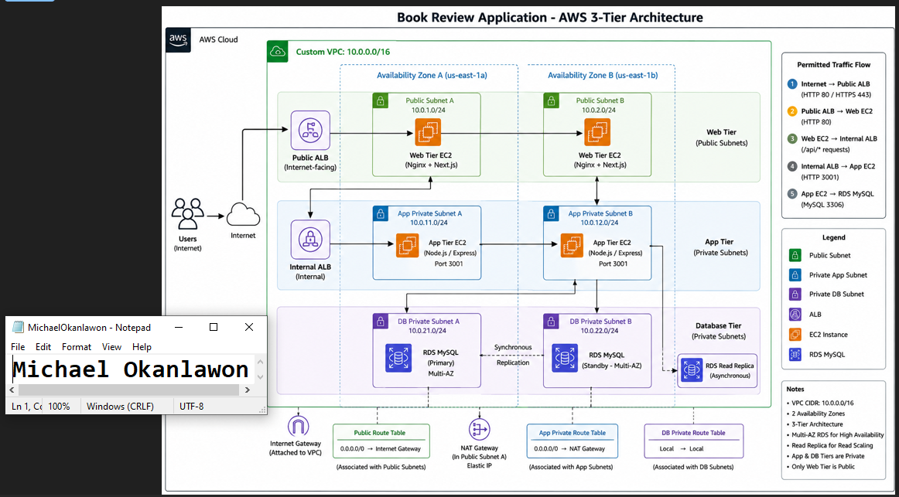
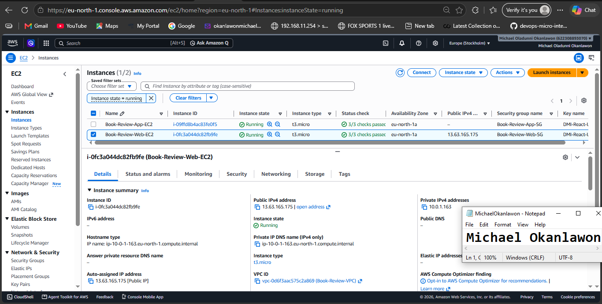
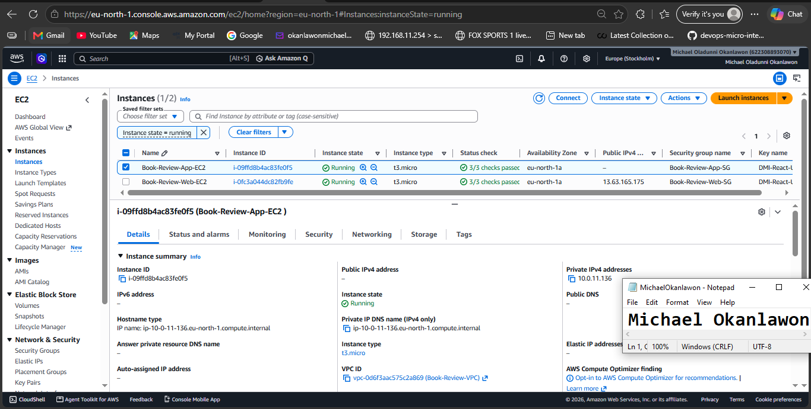
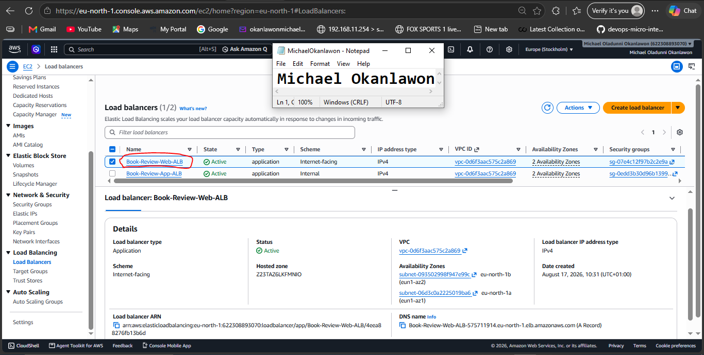
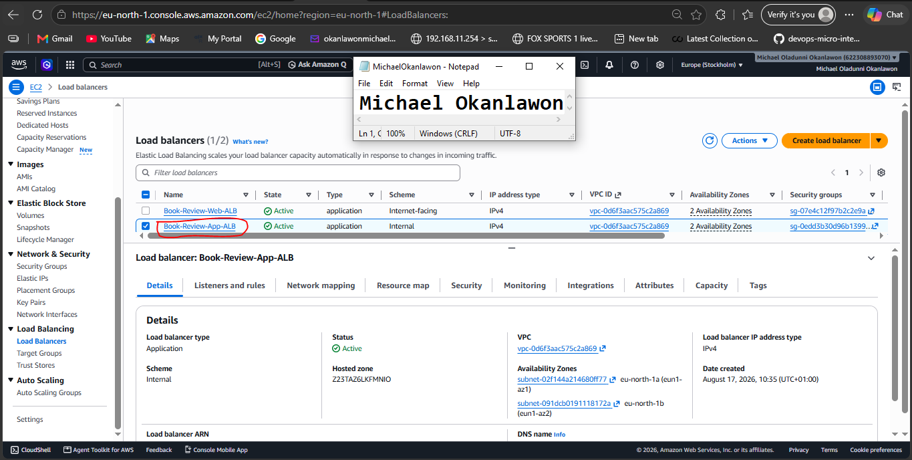
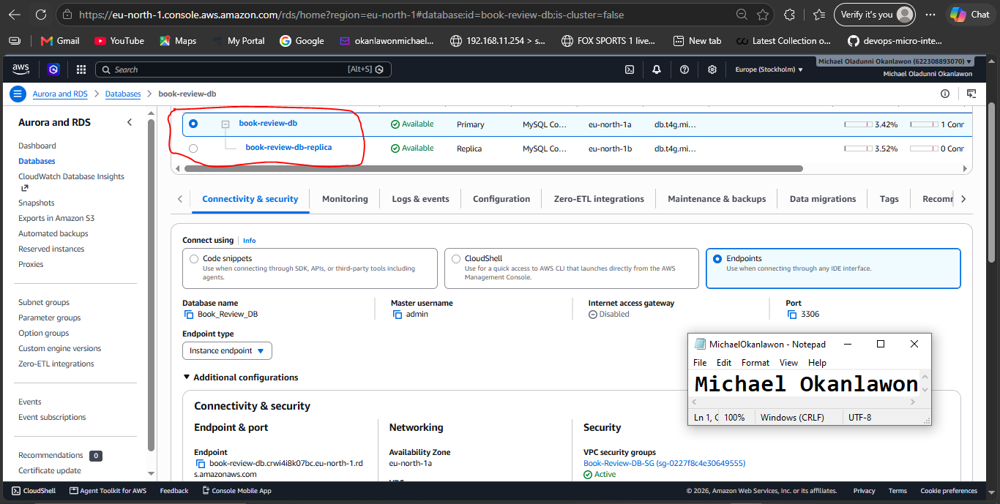
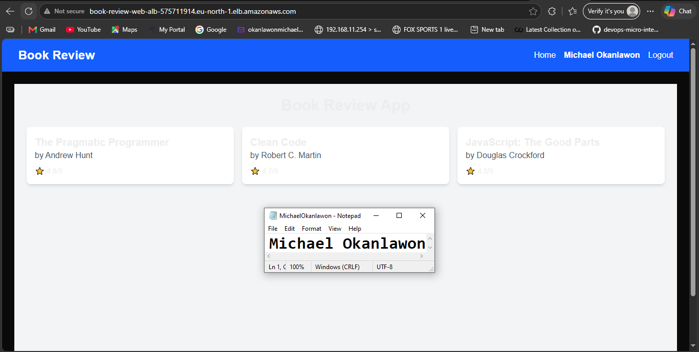
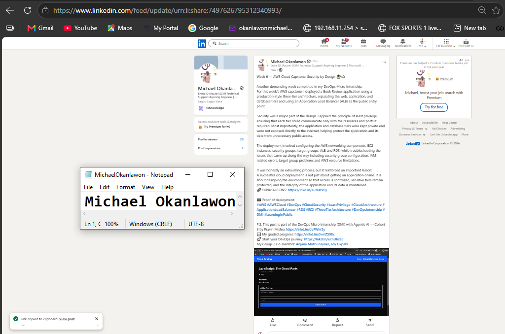

# Assignment 6 — Capstone Assignment — Deploy Book Review App (Three-Tier Architecture) on AWS

Part of the DevOps Micro Internship (DMI) Cohort 3 with Agentic AI

---

## Purpose

This is the most important assignment of the course. You will deploy the Book Review App in a fully production-style three-tier architecture on AWS: a Next.js Web Tier behind Nginx and a public ALB, a private Node.js/Express App Tier behind an internal ALB, and a private Multi-AZ MySQL RDS database with a read replica. You are expected to design, deploy, isolate, debug, and document the result independently.

---

# Task 1 — Architecture Diagram

## Goal

Create an architecture diagram showing the custom VPC (10.0.0.0/16), the six subnets across two Availability Zones (two public Web Tier, two private App Tier, two private Database Tier), the public ALB, Web Tier EC2/Nginx, internal ALB, private App Tier EC2, private Multi-AZ RDS with its read replica, and the permitted traffic flow.

### Evidence

#### Diagram image or link

---

# Task 2 — AWS Region & Services Used

## Goal

Record the AWS Region used and list every AWS service used across networking, compute, load balancing, security, and the database.

### Notes

**Region:**

AWS Region: eu-north-1 (Europe – Stockholm)

---

**Services:**

Amazon VPC — networking, subnets, route tables and security groups
Amazon EC2 — Web EC2 and App EC2 instances
Elastic Load Balancing — Public ALB and Internal ALB
Amazon RDS for MySQL — primary database and read replica
Amazon EC2 Security Groups — tier-level network security
Amazon CloudWatch — EC2/PM2 monitoring and AWS monitoring

---

# Task 3 — Public Entry Point

## Goal

Confirm the Book Review App loads through the public ALB DNS name.

### Evidence

#### Public ALB DNS

Paste your public ALB DNS name here:

`http://Book-Review-Web-ALB-575711914.eu-north-1.elb.amazonaws.com`

---

# Task 4 — Evidence Screenshots

## Goal

Capture visual proof of every tier and load balancer.

### Evidence

#### Web EC2

---

#### App EC2

---

#### Public ALB

---

#### Internal ALB

---

#### RDS + Replica

---

#### App UI proof

---

# Task 5 — Summary

## Goal

Summarize what worked in the final deployment, the issues encountered and how each was fixed, and the tools or sources used to research and debug.

### Notes

**What worked:**

The Book Review application was successfully deployed on AWS in the eu-north-1 (Europe – Stockholm) Region using a multi-tier architecture. The Web EC2 hosts the Next.js frontend behind Nginx, while the App EC2 hosts the Node.js/Express backend. The Public ALB provides the public entry point to the application.

The frontend successfully communicates with the backend through the ALB and Nginx. The /api/books endpoint returned HTTP 200 OK and successfully retrieved book records from the MySQL database. User registration also returned HTTP 201 Created, and the final browser test successfully displayed the logged-in user and Logout option.

PM2 was configured to manage the frontend and backend processes, and both applications were confirmed to be running on their respective ports.

---

**Issues + fixes:**

1. Frontend could not start from the home directory
npm start initially returned an ENOENT error because package.json was not in /home/ubuntu. The issue was fixed by changing to /home/ubuntu/book-review-app/frontend before running npm commands.

2. Port 3000 was already in use
The existing Next.js process was identified using ss and ps. The process was stopped when required, the frontend was rebuilt successfully, and PM2 was installed and used to manage the frontend.
3.Backend connectivity initially timed out
The Web EC2 could not initially connect to 10.0.11.136:3001. The App Security Group was checked and configured to allow TCP port 3001 from the Web Security Group. Connectivity subsequently succeeded.

4. Nginx initially returned HTTP 504 for /api/books
This was caused by the Web EC2 being unable to reach the backend on port 3001. After the security-group/network issue was corrected, the API successfully returned HTTP 200 through Nginx.

5. Registration initially failed because of CORS
Backend PM2 logs showed CORS policy: Not allowed by server. The ALLOWED_ORIGINS value in the backend .env file was corrected to include the Public ALB URL. The backend was then restarted with PM2 using --update-env.

6. PM2 was not initially installed on the Web EC2
PM2 was installed globally using npm, and the Next.js frontend was successfully started and confirmed as online.

7. Final application validation
After the configuration and networking fixes, registration through the Public ALB returned HTTP 201 Created, API requests returned HTTP 200 OK, and the Book Review application successfully loaded through the Public ALB DNS name.

---

**Tools/sources used:**

AWS Management Console — EC2, VPC, Security Groups, Elastic Load Balancing and RDS

Linux terminal — for deployment, configuration and troubleshooting

SSH — for connecting to the Web and App EC2 instances

Nginx — reverse proxy for the frontend and API traffic

Node.js and npm — application runtime and package management

PM2 — process management for the frontend and backend

Git/GitHub — application source code

cURL — testing API, ALB and Nginx connectivity

ss and ps — checking listening ports and running processes

PM2 logs — diagnosing backend and CORS errors

MySQL/RDS — database connectivity and application data validation

AWS documentation and application/tool documentation — used as references during configuration and troubleshooting

---

# LinkedIn Post (Required)

## Goal

Publish a LinkedIn post sharing the capstone deployment, including the public ALB DNS (or a redacted screenshot), three to five lines on what you built and why it is production-style, and one proof screenshot.

## Evidence

#### LinkedIn Post URL

Paste your LinkedIn post URL here:

`https://www.linkedin.com/posts/michael-okanlawon_aws-awscloud-devops-share-7497626795312340993-jl4S/?utm_source=share&utm_medium=member_desktop&rcm=ACoAAC9A9-IBmPTPhzYSqhRaCI1i6ENsTRA8KEw`

---

#### Screenshot of LinkedIn post

---

# Submission Instructions

- Add all required screenshots and links in your submission
- Do not expose passwords, RDS credentials, connection strings, private keys, or account IDs

---

# Completion Checklist

- [ ] Task 1: Architecture diagram completed
- [ ] Task 2: AWS Region and services documented
- [ ] Task 3: Public ALB DNS confirmed working
- [ ] Task 4: All six evidence screenshots captured (Web Tier, App Tier, both ALBs, RDS + replica, app UI)
- [ ] Task 5: Deployment summary completed (what worked, issues/fixes, tools/sources)
- [ ] LinkedIn post published and URL submitted
- [ ] App Tier and Database Tier confirmed not publicly accessible
- [ ] No sensitive data exposed

---

## 📌 About DMI & CloudAdvisory

DevOps Micro Internship (DMI) is a project-based DevOps program run by Pravin Mishra (The CloudAdvisory) focused on real-world execution, systems thinking, and career readiness.

It helps learners build strong DevOps foundations with hands-on experience.

---

## 📌 Resources

- 🌐 DMI Official Website: https://dmi.pravinmishra.com?utm_source=github&utm_medium=readme  
- 🎓 University: https://university.pravinmishra.com?utm_source=github&utm_medium=readme  
- 💬 Discord Community: https://discord.pravinmishra.com?utm_source=github&utm_medium=readme  
- 📝 Blog: https://dmi.pravinmishra.com/blog?utm_source=github&utm_medium=readme  
- ▶️ YouTube Playlist: https://www.youtube.com/playlist?list=PLFeSNDtI4Cho  
- 🔗 Pravin Mishra (LinkedIn): https://www.linkedin.com/in/pravin-mishra-aws-trainer/  
- 🏢 CloudAdvisory (LinkedIn): https://www.linkedin.com/company/thecloudadvisory/

---

*This submission is part of DevOps Micro Internship (DMI) Cohort 3 — Agentic AI Track.*