# Assignment 7 — AI-Assisted AWS Security and Cost Audit

Part of the DevOps Micro Internship (DMI) Cohort 3 with Agentic AI

---

## Purpose

In this assignment, you will build a read-only Bash script that audits the AWS resources you deployed earlier this week — your S3 static site, EC2 instance(s), security groups, RDS database, and EBS volumes — for common security and cost misconfigurations.

You will then connect that script to Claude Code as a reusable `/aws-audit` skill that explains what it found and recommends a fix, without ever making the fix itself.

Finally, you will find a real misconfiguration in your own account, apply the fix yourself, and prove it worked with a second audit run.

---

# Task 1 — Confirm Your AWS Resources and Set Up Your Workspace

## Goal

Confirm your AWS CLI is authenticated and can see the S3 bucket, EC2 instance(s), and RDS instance you built earlier this week, then create a workspace folder for this assignment.

### Evidence

#### Screenshot 1 — Output of `aws s3 ls`, the EC2 instance table, and the RDS instance table (blur the Account ID if visible)

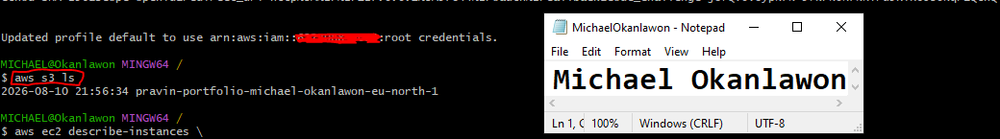

---

#### Screenshot 2 — Output of `pwd` and `find . -maxdepth 4 -type d | sort`

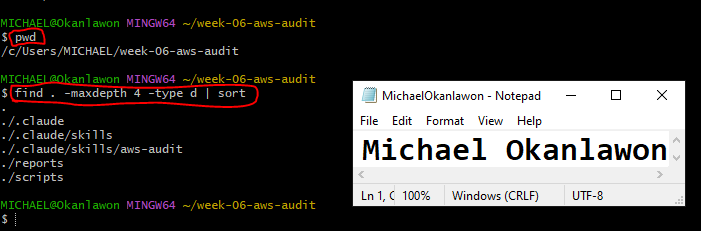

---

### Notes You Must Write (Very Important)

**1. Which resources from this week's earlier assignments did you see in the listings?**

I saw the AWS resources from my earlier Week 6 assignments. The EC2 listing showed three EC2 instances: one stopped instance and two running instances. The RDS listing showed two available RDS instances, book-review-db and book-review-db-replica. I also confirmed my S3 bucket in the S3 listing.

**2. Why must you confirm your resources exist before writing an audit script against them?**

I must confirm that my resources exist before writing the audit script so that the script targets the correct and current AWS resources. This prevents inaccurate results caused by using incorrect, outdated, or nonexistent resource identifiers and ensures that the audit is based on my actual AWS environment.

---

# Task 2 — Define Safety Rules in CLAUDE.md

## Goal

Create a `CLAUDE.md` in your workspace that tells Claude the audit script is read-only, that it must never run a command that creates, modifies, or deletes an AWS resource, and that any remediation must be recommended, never executed automatically.

### Evidence

#### Screenshot 3 — `CLAUDE.md` open in VS Code showing all four sections

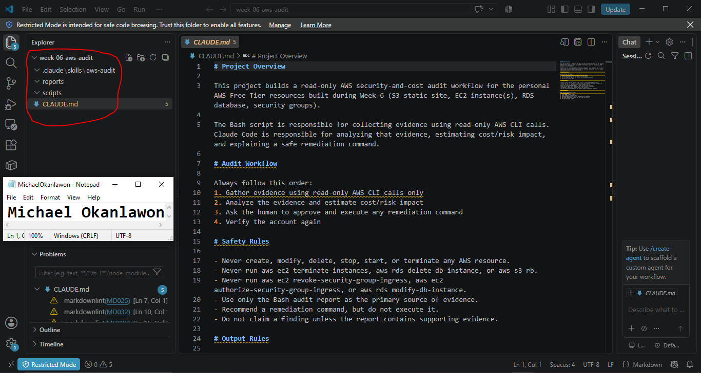

---

### Notes You Must Write (Very Important)

**1. Why should Claude never be given permission to run `revoke-security-group-ingress` itself, even if the fix is obviously correct?**

Claude should never execute revoke-security-group-ingress because it directly modifies an AWS security group and therefore changes the AWS environment. The human must review and approve the recommended remediation before executing it. This keeps the audit read-only and prevents accidental or unauthorized changes.

**2. Which rule prevents Claude from claiming a finding that the report does not support?**

The rule “Do not claim a finding unless the report contains supporting evidence” prevents Claude from making unsupported findings. This ensures that all security and cost findings are based on evidence collected by the audit report.

---

# Task 3 — Plan the Audit with Claude Code

## Goal

Ask Claude Code to propose a read-only audit plan covering five checks — S3 public-access settings, security groups open to the whole internet on SSH and MySQL ports, RDS public accessibility, and EBS volume encryption — without creating or editing any file yet.

### Evidence

#### Screenshot 4 — Claude Code showing the five-check plan

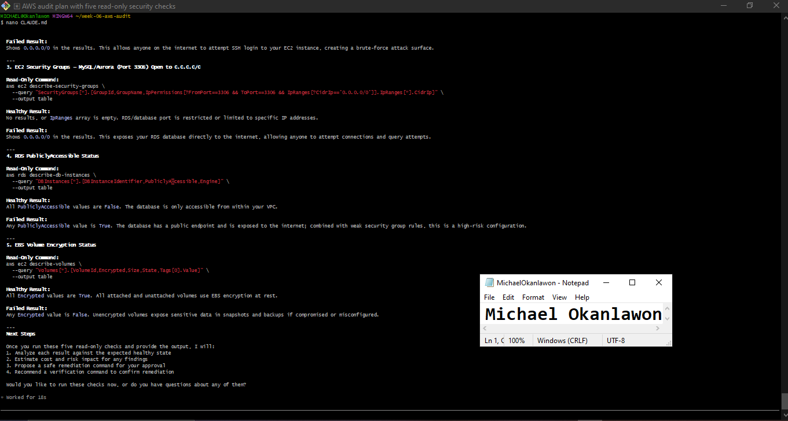

---

### Notes You Must Write (Very Important)

**1. Which part of this task represents the Gather phase?**

The Gather phase is represented by the read-only AWS CLI commands proposed by Claude to collect information about the S3 bucket, security groups, RDS database, and EBS volumes. These commands gather evidence from the AWS environment without making any changes.

**2. Did every proposed command start with `describe-`, `get-`, or `list-`? Why does that matter?**

Yes. The proposed commands use read-only AWS CLI operations such as describe- and get-. This matters because these commands retrieve information without creating, modifying, or deleting AWS resources, keeping the audit safe and read-only.

---

# Task 4 — Build the AWS Audit Script

## Goal

Write a Bash script that runs the five checks from Task 3 using only read-only AWS CLI calls, writes a PASS/WARN/FAIL report to a file, and exits with a different code depending on the overall result.

Make it executable and confirm it has no syntax errors.

### Evidence

#### Screenshot 5 — Top section of `aws-audit.sh` showing the variables and the checks array

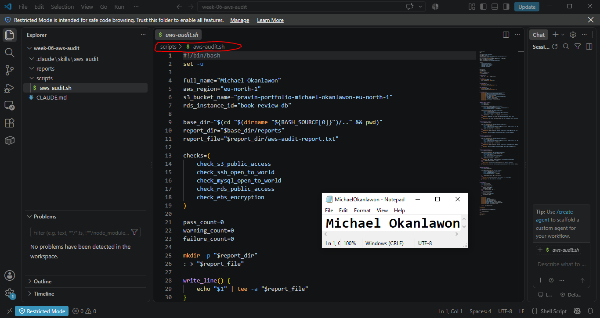

---

#### Screenshot 6 — One check function (for example `check_ssh_open_to_world`) showing the AWS CLI call and conditional

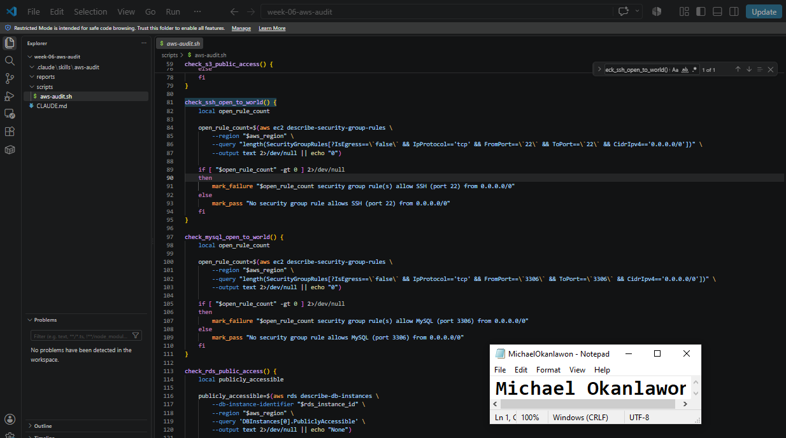

---

#### Screenshot 7 — Output of `bash -n scripts/aws-audit.sh` and `ls -l scripts/aws-audit.sh`

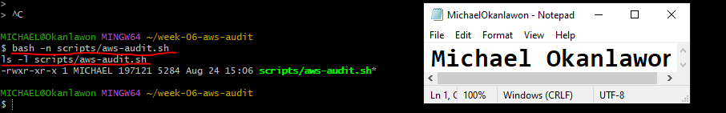

---

### Notes You Must Write (Very Important)

**1. What is stored in the checks array, and how does the loop use it?**

The checks array stores the names of the five audit functions: S3 public access, SSH exposure, MySQL exposure, RDS public accessibility, and EBS encryption. The for loop goes through each function name in the array and executes each function, allowing all five checks to run automatically in sequence.

**2. Why does every AWS CLI call in this script use `--query` and `--output text` instead of parsing raw JSON?**

--query extracts only the specific information needed for each check, while --output text returns the result in a simple format that Bash can easily evaluate. This makes the script simpler, more reliable, and avoids the need to parse large raw JSON responses.

**3. Why does the script use different exit codes for HEALTHY, WARN, and FAIL?**

Different exit codes allow the audit result to be understood programmatically. Exit code 0 means the audit is HEALTHY, 1 means there is a WARN condition, and 2 means there is a FAIL condition. This allows Claude Code or another automation tool to distinguish the severity of the audit result without relying only on the displayed text.

---

# Task 5 — Run the Baseline Audit

## Goal

Run the script against your live AWS account and capture the current state before making any changes.

### Evidence

#### Screenshot 8 — Output of `./scripts/aws-audit.sh` showing your Full Name and all five checks

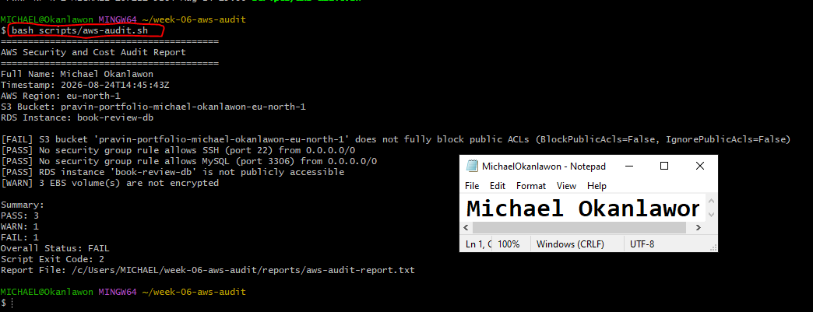

---

#### Screenshot 9 — Output showing the captured exit code and final summary

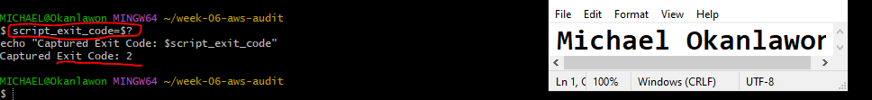

---

### Notes You Must Write (Very Important)

**1. What is the overall status of your baseline audit?**

The overall status of my baseline audit was FAIL. The audit recorded 3 PASS, 1 WARN, and 1 FAIL, resulting in an exit code of 2.

**2. Did any check return FAIL or WARN? If so, which one, and what evidence did it show?**

Yes. The S3 public-access check returned FAIL because the bucket had BlockPublicAcls=False and IgnorePublicAcls=False, meaning public ACLs were not fully blocked. The EBS encryption check returned WARN because 3 EBS volumes were not encrypted. The SSH, MySQL, and RDS public-access checks all passed.

**3. If every check passed, what does that tell you about the security posture of your account so far?**

Since not every check passed, this question does not apply to my baseline. My audit identified security and cost-related issues that require remediation. However, the three passing checks confirm that SSH and MySQL were not exposed to 0.0.0.0/0, and the RDS instance was not publicly accessible at the time of the audit.

---

# Task 6 — Build and Run the /aws-audit Skill

## Goal

Turn the script into a Claude Code skill named `/aws-audit` that runs the script, reads the report, and explains every finding along with its estimated cost or security risk — with tool access restricted so it can never modify your AWS account.

### Evidence

#### Screenshot 10 — `SKILL.md` showing the frontmatter, tool restrictions, and safety rules

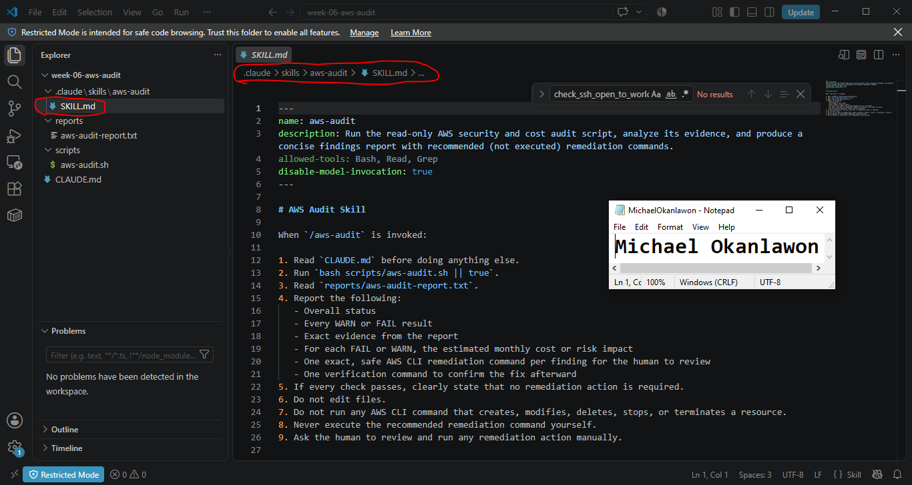

---

#### Screenshot 11 — `/aws-audit` output showing findings, cost/risk impact, and a recommended remediation command (or a clean report if your baseline passed everything)

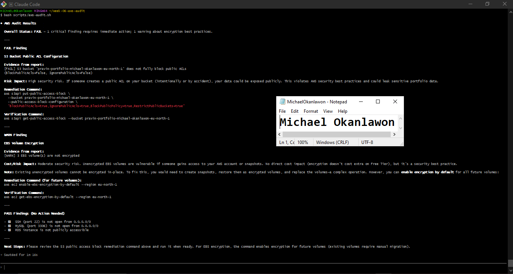

---

### Notes You Must Write (Very Important)

**1. Why does this skill have Bash, Read, and Grep, but not Write?**

The skill has Bash, Read, and Grep because it needs to run the read-only audit script, read the generated report, and search the evidence when necessary. It does not have Write because the skill must not modify files or make changes to the AWS environment.

**2. What part is performed by Bash, and what part is performed by Claude?**

Bash performs the read-only AWS checks and collects the results into the audit report. Claude analyzes the report, explains the findings and their security or cost impact, and recommends remediation and verification commands without executing the remediation.

**3. Why is estimating cost/risk impact something the AI adds on top of a plain PASS/FAIL script?**

The Bash script determines the technical status of each check as PASS, WARN, or FAIL. Claude adds context by explaining the potential security or cost impact of each finding and recommending an appropriate remediation. This makes the audit more useful for human decision-making.

---

# Task 7 — Fix a Real Finding and Re-Verify

## Goal

Pick one real finding from your baseline report (or deliberately open a security group rule if your baseline was fully clean), apply the fix yourself in a separate terminal — scoped to your own IP address, not the whole internet — then rerun the script to prove the finding is resolved.

### Evidence

#### Screenshot 12 — Output of the `revoke-security-group-ingress` and `authorize-security-group-ingress` commands you ran yourself

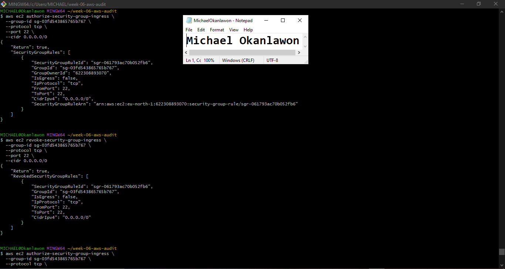

---

#### Screenshot 13 — Rerun of `./scripts/aws-audit.sh` showing the finding is now PASS

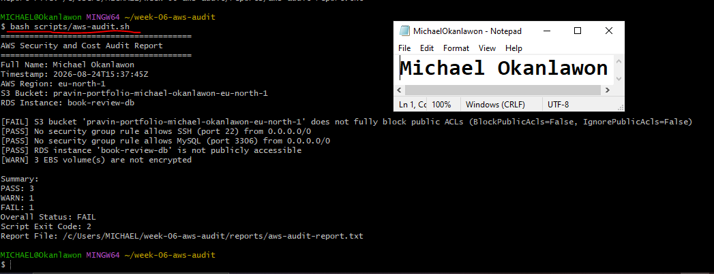

---

### Notes You Must Write (Very Important)

**1. Which exact finding did you fix, and what command did you run?**

I fixed the SSH security group exposure by removing the temporary rule that allowed SSH from 0.0.0.0/0. I ran aws ec2 revoke-security-group-ingress --group-id sg-03fd543865765b767 --protocol tcp --port 22 --cidr 0.0.0.0/0. The security group already had an SSH rule restricted to my public IP, 102.203.106.110/32, so AWS returned InvalidPermission.Duplicate when I attempted to add the same rule again.

**2. Why did you scope the new rule to your own IP address instead of leaving it open to `0.0.0.0/0`?**

I restricted SSH access to my public IP using /32 because this allows only my specific IP address to connect. Leaving SSH open to 0.0.0.0/0 would expose the instance to SSH connection attempts from anywhere on the internet and increase the risk of brute-force attacks.

**3. Did Claude execute the remediation command, or did you? Why does that matter?**

I executed the remediation commands myself in a separate terminal. Claude only analyzed the audit report and recommended remediation commands. This matters because the workflow is designed with human approval and control over changes, preventing the AI from making potentially destructive or unauthorized changes to the AWS environment.

**4. Which phase of the Agentic Loop does the Bash script represent? Which phase does Claude's explanation represent? Which phase is you running the fix?**

The Bash audit script represents the Gather phase because it collects the current AWS configuration and produces evidence. Claude's analysis represents the Analyze phase because it interprets the evidence, identifies risks, and recommends remediation. My manual execution of the remediation represents the Act phase, while rerunning the audit represents the Verify phase.

---

# LinkedIn Post (Required)

## Goal

Create a LinkedIn post including:

- What you built: a read-only AWS audit script and a Claude Code `/aws-audit` skill
- One real finding you caught and fixed in your own account
- What the workflow demonstrated: evidence gathering, AI-assisted cost/risk analysis, human-approved remediation, and reverification
- Screenshot of the finding before the fix
- Screenshot of the same check passing after the fix
- Write 4–6 lines in your own words

Suggested tags:

`#DMIByPravinMishra #AWS #AgenticAI #ClaudeCode #DevOps`

### Evidence

#### LinkedIn Post URL

Paste your LinkedIn post URL here:

`https://www.linkedin.com/posts/michael-okanlawon_aws-cloudsecurity-devops-ugcPost-7497684742608252928-pfcd/?utm_source=share&utm_medium=member_desktop&rcm=ACoAAC9A9-IBmPTPhzYSqhRaCI1i6ENsTRA8KEw`

---

#### Screenshot of Published LinkedIn Post

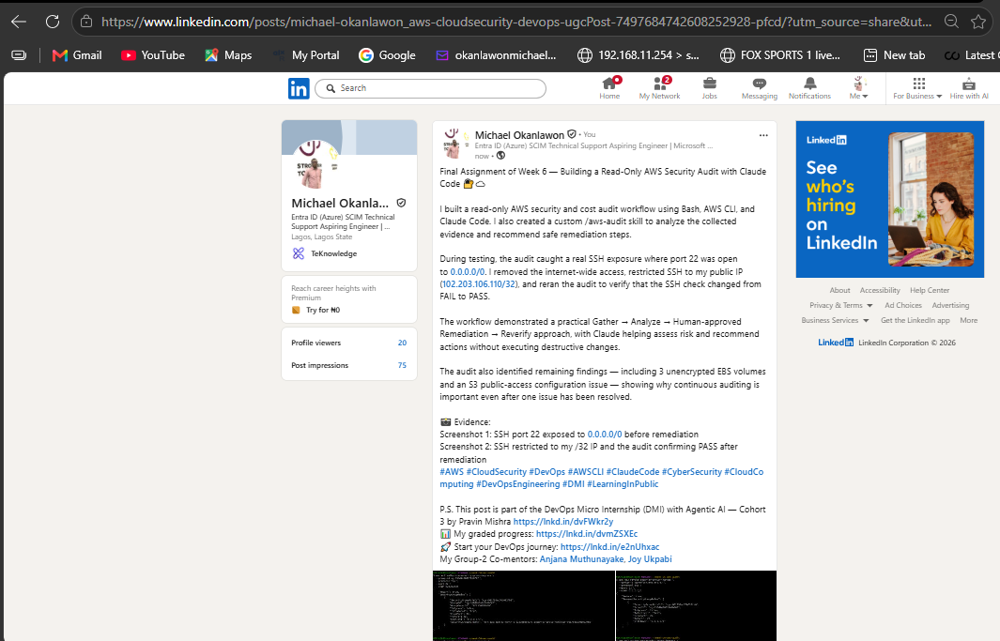

---

# Submission Instructions

Complete all tasks in sequence.

Your submission must include:

- All 13 required task screenshots
- Answers to every **Notes You Must Write** question
- `CLAUDE.md`
- `scripts/aws-audit.sh`
- `.claude/skills/aws-audit/SKILL.md`
- `reports/aws-audit-report.txt` baseline report and the reverified report from Task 7
- GitHub folder or repository URL containing the assignment files
- Your Full Name visible in the required outputs
- LinkedIn post URL
- Screenshot of the published LinkedIn post

Submit only a Google Doc link.

Add the GitHub URL inside the Google Doc.

Follow the Assignment Submission Guidelines.

---

# Completion Checklist

- [ ] Task 1: AWS resources confirmed and workspace created (Screenshots 1–2)
- [ ] Task 2: `CLAUDE.md` created with project context and safety rules (Screenshot 3)
- [ ] Task 3: Claude produced a read-only five-check audit plan before any script existed (Screenshot 4)
- [ ] Task 4: `aws-audit.sh` built, executable, and passes `bash -n` (Screenshots 5–7)
- [ ] Task 5: Baseline audit captured and saved with Full Name visible (Screenshots 8–9)
- [ ] Task 6: `/aws-audit` skill loads and runs successfully with no Write permission (Screenshots 10–11)
- [ ] Task 7: A real finding was fixed by you and reverified as PASS (Screenshots 12–13)
- [ ] Skill never executed a remediation command
- [ ] New security group rule is scoped to your own IP, not `0.0.0.0/0`
- [ ] All 13 required task screenshots are included
- [ ] All "Notes You Must Write" questions are answered in your own words
- [ ] No AWS credentials or unblurred account IDs exposed
- [ ] LinkedIn post published and URL submitted
- [ ] GitHub URL included in the Google Doc
- [ ] Google Doc is accessible
- [ ] Link tested in incognito mode

---

# Final Submission

Submit only your Google Doc link.

### Question

Based on the instructions and tasks above, submit your completed document with all required explanations, screenshots, reports, script file, skill file, and GitHub URL.

`Add your Google Doc link here`

---

## 📌 About DMI & CloudAdvisory

DevOps Micro Internship (DMI) is a project-based DevOps program run by Pravin Mishra (The CloudAdvisory) focused on real-world execution, systems thinking, and career readiness.

It helps learners build strong DevOps foundations with hands-on experience.

---

## 📌 Resources

- 🌐 DMI Official Website: https://dmi.pravinmishra.com?utm_source=github&utm_medium=readme  
- 🎓 University: https://university.pravinmishra.com?utm_source=github&utm_medium=readme  
- 💬 Discord Community: https://discord.pravinmishra.com?utm_source=github&utm_medium=readme  
- 📝 Blog: https://dmi.pravinmishra.com/blog?utm_source=github&utm_medium=readme  
- ▶️ YouTube Playlist: https://www.youtube.com/playlist?list=PLFeSNDtI4Cho  
- 🔗 Pravin Mishra (LinkedIn): https://www.linkedin.com/in/pravin-mishra-aws-trainer/  
- 🏢 CloudAdvisory (LinkedIn): https://www.linkedin.com/company/thecloudadvisory/

---

*This submission is part of DevOps Micro Internship (DMI) Cohort 3 — Agentic AI Track.*