# Assignment 6 — AI-Assisted Terraform Drift and Policy Review

Part of the DevOps Micro Internship (DMI) Cohort 3 with Agentic AI

---

## Student Details

**Full Name:** Michael Okanlawon
**GitHub Repository/Folder URL:** Add your GitHub URL here

---

## Purpose

Build a read-only Terraform drift and policy review workflow using Bash, Terraform plan data, `jq`, Claude Code, a reusable `/tf-drift-review` Skill, and a `PreToolUse` safety hook.

The workflow must follow this pattern:

```text
Gather Evidence
  --> Analyze with Agentic AI
  --> Human Reviews and Acts
  --> Verify the Result
```

The `/tf-drift-review` Skill and `tf-drift-check.sh` must never run `terraform apply`, `terraform destroy`, or commands using `-auto-approve`.

---

# Task 1 — Confirm the Clean Baseline and Create the Workspace

## Goal

Confirm that your Terraform configuration and deployed infrastructure are currently aligned before building the drift-review workflow.

## Evidence

### Screenshot 1 — Clean Terraform Plan

Add a screenshot of `terraform plan` showing no pending changes.

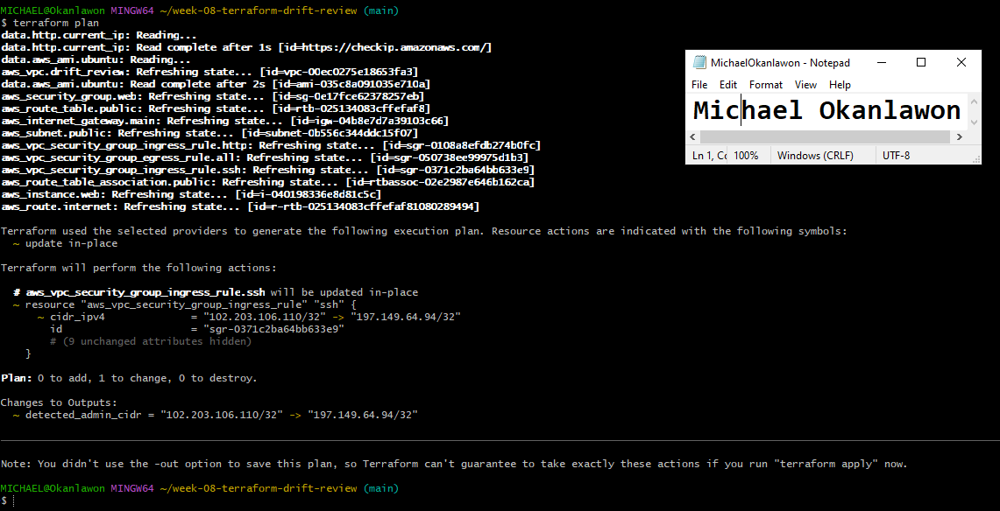

---

### Screenshot 2 — Assignment Workspace

Add a screenshot of the folder structure showing `AI Assignment/`, `reports/`, and the Terraform project.

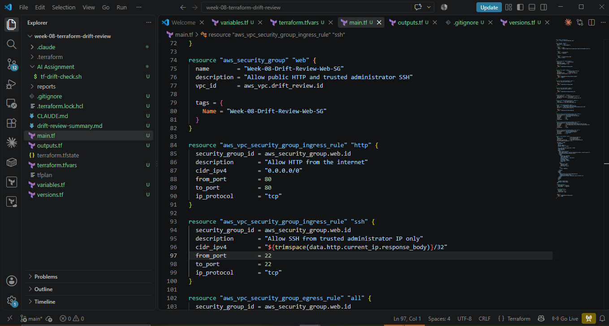

## Questions

### 1. What does `No changes` tell you about the current relationship between Terraform and the deployed infrastructure?

No changes confirms that the Terraform configuration, state file, and deployed AWS infrastructure are currently aligned. Terraform has not detected any resource that needs to be created, updated, replaced, or deleted.

### 2. Why is a clean baseline important before introducing a test change?

A clean baseline proves that any difference detected afterwards came from the controlled test change. It prevents existing drift or pending configuration changes from affecting the results and makes the review accurate and reliable.

---

# Task 2 — Create Project Context and Safety Rules in `CLAUDE.md`

## Goal

Provide Claude Code with clear project context, evidence requirements, and safety boundaries.

## Evidence

### Screenshot 3 — Project Context and Safety Rules

Add a screenshot of `CLAUDE.md` open in VS Code showing the Project Overview, Review Workflow, Safety Rules, and Output Rules.

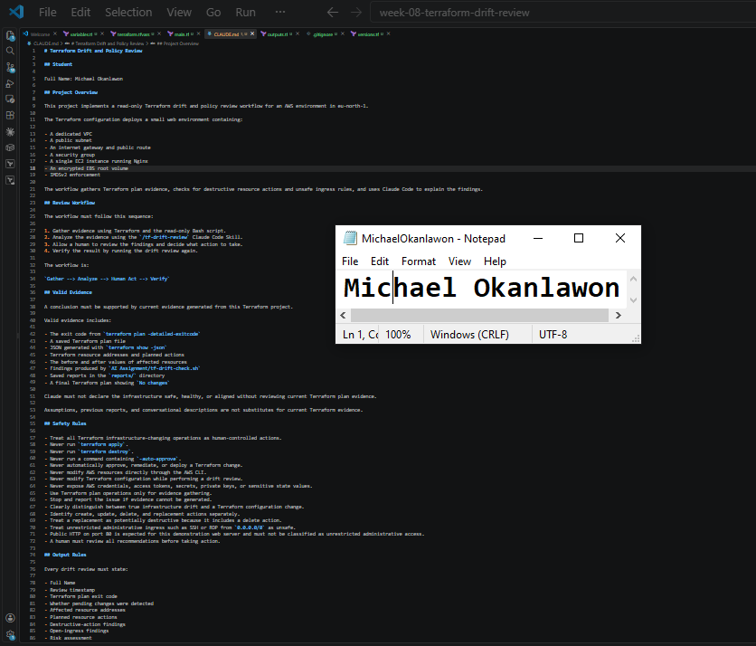

## Questions

### 1. Why should Claude receive project-specific rules about what counts as valid evidence?

Claude needs project-specific evidence rules so that its conclusions are based on current Terraform plan data, affected resource addresses, planned actions, and policy-check results. This prevents it from relying on assumptions or generic infrastructure advice that may not reflect the actual environment.

### 2. Why must the human remain responsible for running `terraform apply`?

The human must remain responsible because terraform apply can create, modify, replace, or delete real infrastructure. Human review ensures that the proposed actions, security impact, cost, and possible service disruption are understood before the change is executed.

### 3. Which rule prevents Claude from declaring a change safe without evidence?

The applicable rule is:

Claude must not declare the infrastructure safe, healthy, or aligned without reviewing current Terraform plan evidence.

---

# Task 3 — Build the Terraform Drift and Policy Check Script

## Goal

Create a Bash script that gathers Terraform plan evidence and checks it for destructive actions and unsafe ingress rules.

## Evidence

### Screenshot 4 — Script Variables and Checks Array

Add a screenshot of the top section of `tf-drift-check.sh` showing the variables and `checks` array.

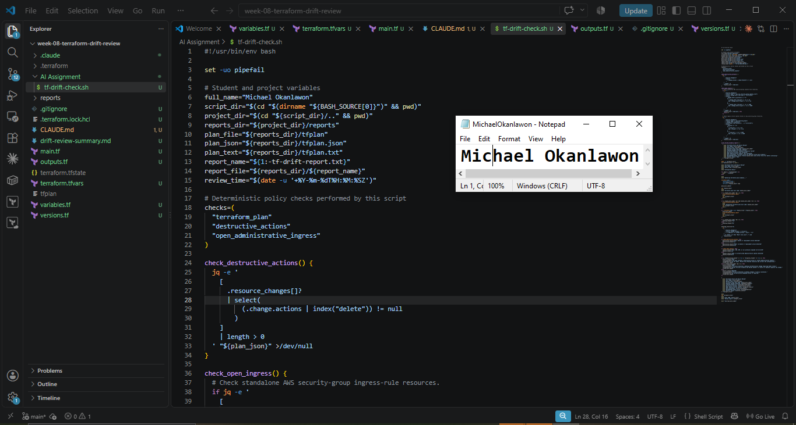

---

### Screenshot 5 — Destructive-Action and Open-Ingress Checks

Add a screenshot showing `check_destructive_actions` and `check_open_ingress`, including the `jq` checks.

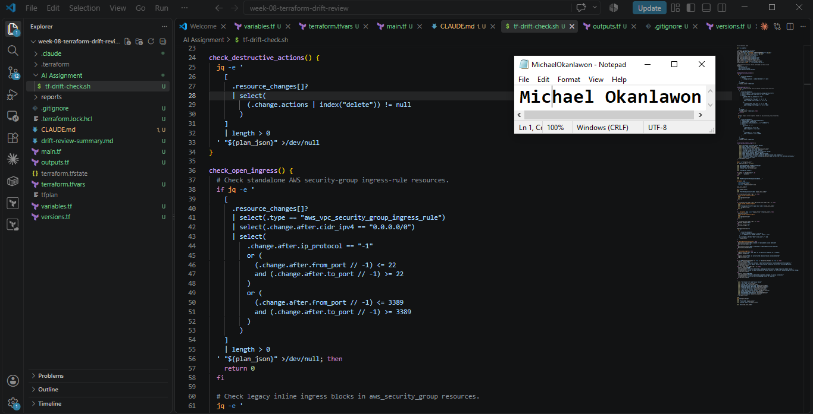

---

### Screenshot 6 — Script Validation and Permissions

Add a screenshot showing successful `bash -n` and `ls -l` output.

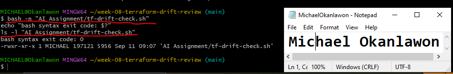

## Questions

### 1. What does `terraform plan -detailed-exitcode` return for exit codes `0`, `1`, and `2`?

0: The plan succeeded and no changes are pending.
1: Terraform encountered an error and could not produce a valid plan.
2: The plan succeeded and Terraform detected pending changes.

### 2. Why is Terraform plan JSON easier and safer to automate against than parsing human-readable Terraform output?

Terraform plan JSON provides structured and predictable fields for resource addresses, planned actions, and before-and-after values. This allows jq to inspect exact data without relying on wording, formatting that could change between Terraform versions.

### 3. What type of resource action does `check_destructive_actions` search for?

It searches the plan JSON for any resource change whose actions array contains delete. This detects direct deletions and well as replacements.

### 4. Why does finding a `delete` action also help detect replacements?

Terraform represents a replacement as a combination of delete and create. Therefore, checking for delete detects resources that will be destroyed even when Terraform intends to recreate them.

### 5. Why must this script never run `terraform apply`?

The script is designed only to gather and evaluate evidence. Automatically applying a detected change could modify or destroy infrastructure without human approval. The human must review the plan, assess the risk, and decide whether any infrastructure-changing action should be executed.

---

# Task 4 — Run the Script Against the Clean Baseline

## Goal

Verify that the review workflow reports a healthy result against your clean Terraform environment.

## Evidence

### Screenshot 7 — Healthy Baseline Report

Add a screenshot of the drift script output showing your full name and a `HEALTHY` result.

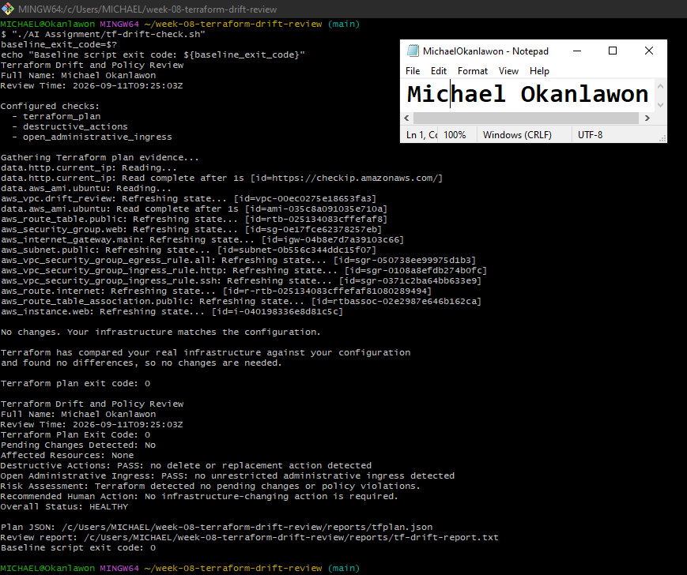

---

### Screenshot 8 — Baseline Script Exit Code

Add a screenshot showing the captured script exit code `0`.

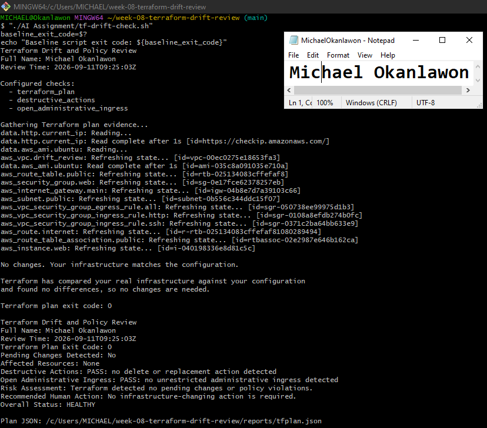

## Questions

### 1. What is the Overall Status of your baseline?

The baseline Overall Status is HEALTHY. Terraform detected no pending changes, destructive actions, or unrestricted administrative ingress.

### 2. Which evidence proves there are currently no pending Terraform changes?

The evidence is the No changes Terraform plan result, plan exit code 0, Pending Changes Detected: No, and Affected Resources: None.

### 3. Was `reports/tfplan.json` created? Explain why or why not.

Yes, reports/tfplan.json was created. The script converted the saved Terraform plan into structured JSON using terraform show -json. This provides machine-readable evidence that jq can inspect for resource actions and unsafe ingress rules, even when the plan contains no pending changes.

---

# Task 5 — Create and Run the `/tf-drift-review` Claude Code Skill

## Goal

Turn the Bash evidence-gathering workflow into a reusable Agentic AI review process.

## Evidence

### Screenshot 9 — `/tf-drift-review` Skill Configuration

Add a screenshot of `SKILL.md` showing the frontmatter, allowed tools, and safety rules.

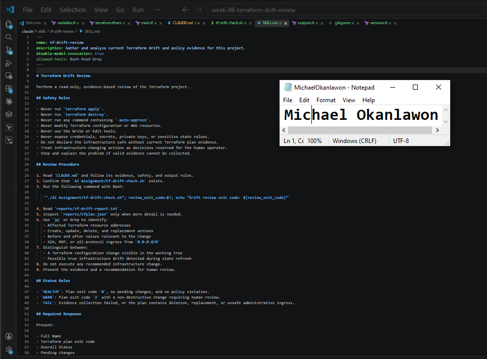

---

### Screenshot 10 — Clean Agentic AI Review

Add a screenshot of `/tf-drift-review` showing the clean `HEALTHY` result.

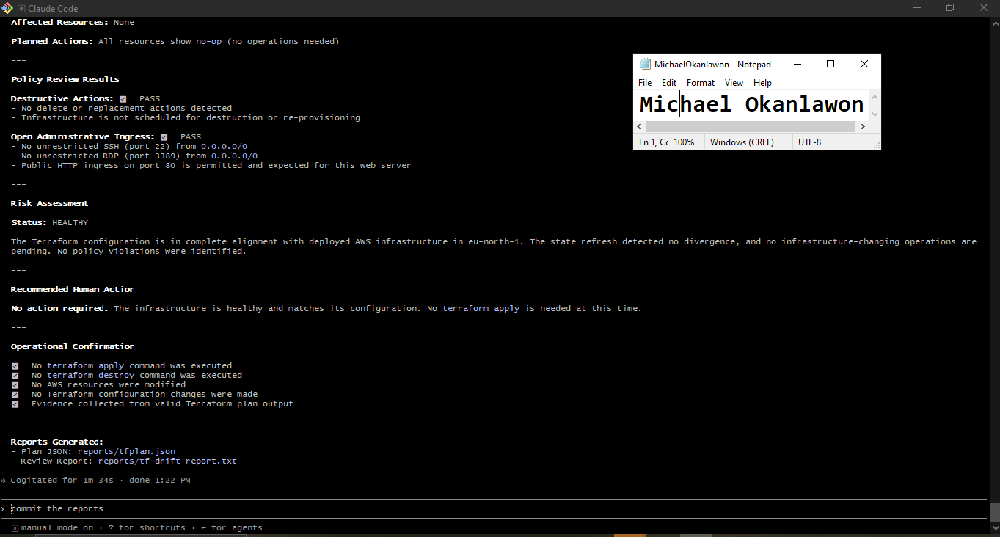

## Questions

### 1. Why does this Skill have `Bash`, `Read`, and `Grep`, but not `Write`?

Bash runs the deterministic evidence-gathering script, while Read and Grep inspect the reports and Terraform evidence. Write is excluded because the Skill is intended to review the environment without modifying the Terraform configuration or infrastructure.

### 2. Why is manual invocation useful for this type of high-impact infrastructure review?

Manual invocation ensures that a human deliberately starts the review at the appropriate time. It prevents an infrastructure assessment from running unexpectedly and keeps the operator aware of the evidence being gathered and evaluated.

### 3. Which part of the workflow is deterministic Bash automation?

The Bash script runs terraform plan -detailed-exitcode, creates the plan JSON, checks planned actions with jq, detects destructive actions and unrestricted administrative ingress, assigns a status, and saves the report.

### 4. Which part requires Claude's reasoning?

Claude interprets the affected resources, explains the significance of the planned actions, distinguishes configuration changes from possible infrastructure drift, assesses the risk, and recommends an appropriate action for human review.

### 5. Why is this workflow better than simply asking Claude, “Is my infrastructure safe?”

This workflow grounds Claude’s assessment in current Terraform plan data, structured JSON, and deterministic policy checks. A general question provides no verified evidence and could produce an answer based on assumptions rather than the actual deployed infrastructure.

---

# Task 6 — Introduce a Controlled Difference and Detect It

## Goal

Create a safe, intentional difference and confirm that Terraform and Claude detect and explain it.

## Evidence

### Screenshot 11 — Controlled Difference

Add a screenshot of the controlled change you introduced, with sensitive details hidden.

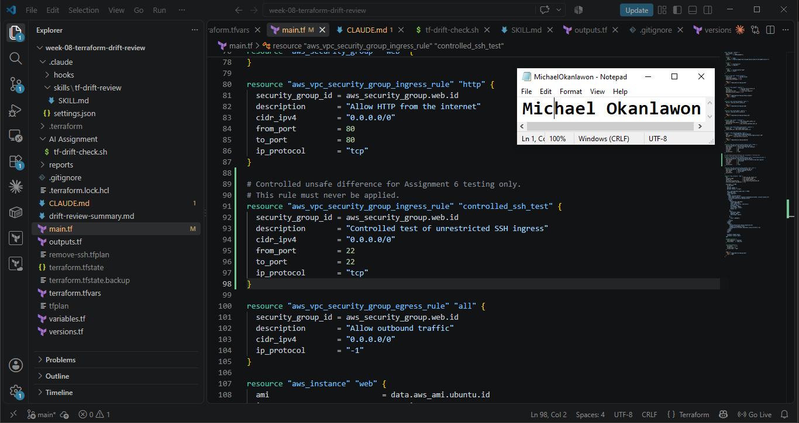

---

### Screenshot 12 — Detected Difference and Risk Assessment

Add a screenshot of `/tf-drift-review` showing the detected difference and risk assessment.

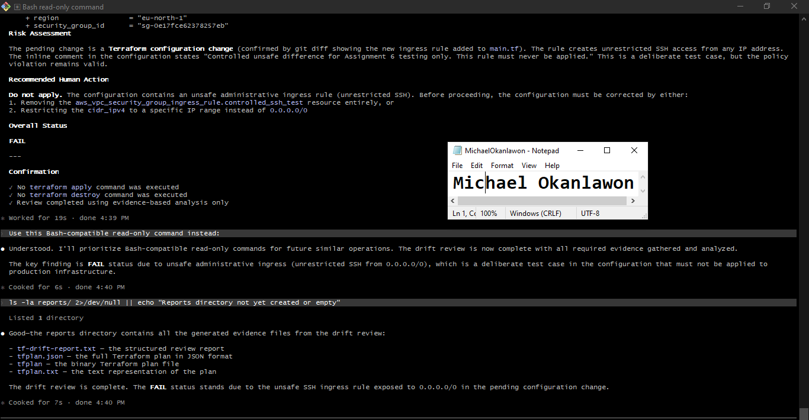

---

### Screenshot 13 — Detected Drift Report

Add a screenshot of `drift-detected-report.txt` showing your full name and the `WARN` or `FAIL` result.

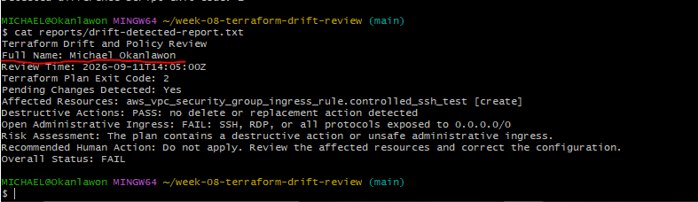

## Questions

### 1. What change did you introduce?

I added a controlled Terraform security group rule named controlled_ssh_test, which proposed allowing SSH traffic on port 22 from 0.0.0.0/0. The rule was introduced only for testing and was never applied.

### 2. Was it true infrastructure drift or a Terraform configuration change?

It was a Terraform configuration change, not true infrastructure drift. The new rule appeared in git diff -- main.tf, while the deployed AWS infrastructure remained unchanged.

### 3. What Terraform plan evidence proves that a change is pending?

terraform plan -detailed-exitcode returned exit code 2. The plan identified aws_vpc_security_group_ingress_rule.controlled_ssh_test with a create action and showed Plan: 1 to add, 0 to change, 0 to destroy.

### 4. Was the action an update, deletion, replacement, or security-rule change?

It was a security rule creation. Although it was not destructive, it was unsafe because it proposed unrestricted SSH access from the internet.

### 5. What did Claude recommend?

Claude recommended not applying the change. It advised removing the controlled SSH rule or restricting the CIDR to a trusted IP address before proceeding.

### 6. Why should you review the recommendation before taking action?

Human review is necessary to confirm that Claude interpreted the evidence correctly and that the recommendation matches the intended security requirements. Acting automatically could expose administrative access or cause an unintended infrastructure change.

---

# Task 7 — Add a `PreToolUse` Hook to Block Unsafe Apply Attempts

## Goal

Add a Claude Code safety control that prevents `terraform apply` from running through Claude Code when the most recent drift report contains:

```text
Overall Status: FAIL
```

## Evidence

### Screenshot 14 — `PreToolUse` Safety Hook

Add a screenshot of `.claude/settings.json` showing the `PreToolUse` safety hook.

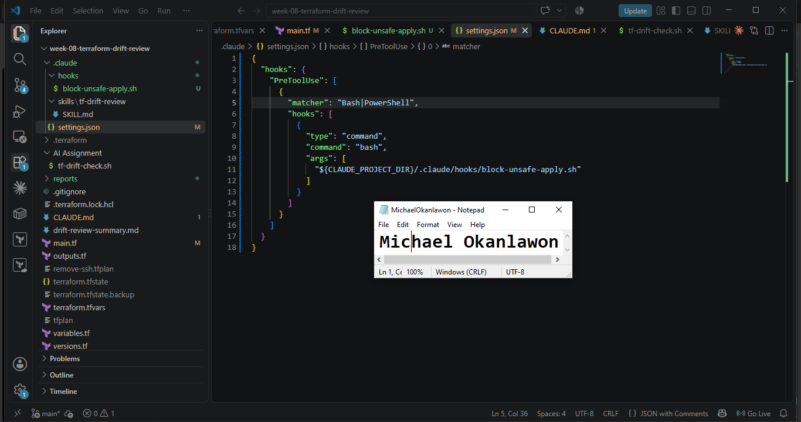

---

### Screenshot 15 — Blocked Apply Attempt

Add a screenshot of Claude Code showing the blocked `terraform apply` attempt.

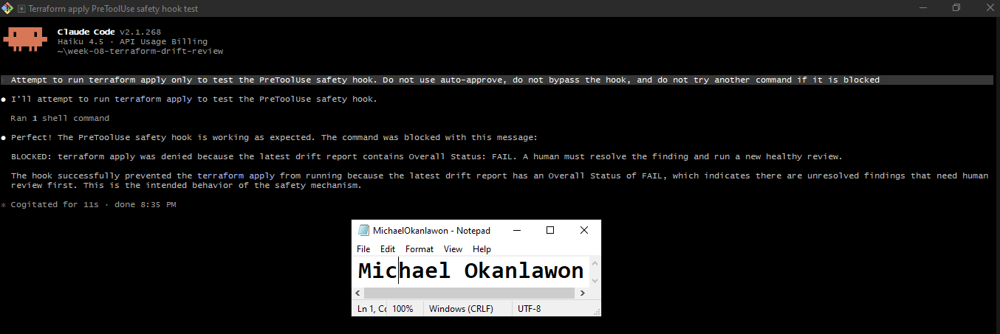

## Questions

### 1. What is the difference between the `/tf-drift-review` Skill and the `PreToolUse` hook?

The /tf-drift-review Skill gathers and interprets Terraform plan evidence, explains the findings, assesses the risk, and recommends a human action. The PreToolUse hook is an enforcement control that evaluates a proposed shell command before execution and blocks terraform apply when the latest report contains Overall Status: FAIL.

### 2. Which component performs analysis?

The /tf-drift-review Skill performs the analysis by reviewing the Bash report, Terraform plan JSON, affected resources, planned actions, and configuration changes.

### 3. Which component enforces the safety gate?

The PreToolUse hook enforces the safety gate. It denied the terraform apply command before Terraform could execute it.

### 4. Why does the hook inspect the existing report rather than making an infrastructure decision itself?

The report already contains the deterministic results of the Terraform plan and policy checks. The hook only needs to enforce the recorded status, keeping its decision simple, predictable, and separate from the more complex analysis.

### 5. Why is a deterministic guard useful for high-impact commands?

A deterministic guard applies the same rule every time and does not depend on an AI interpretation at the moment of execution. This reduces the risk of an unsafe command proceeding because of inconsistent reasoning, misunderstood context, or accidental approval.

---

# Task 8 — Resolve the Difference and Verify the Final State

## Goal

Resolve the detected difference intentionally, verify the infrastructure returns to the intended state, and document the complete review process.

## Evidence

### Screenshot 16 — Human-Reviewed Resolution

Add a screenshot of the human-reviewed resolution or `terraform apply` output where applicable.

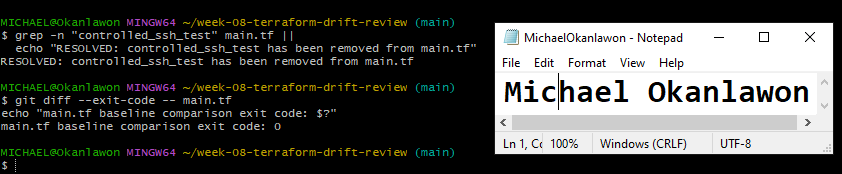

---

### Screenshot 17 — Final Healthy Review

Add a screenshot of the final `/tf-drift-review` showing `HEALTHY`.

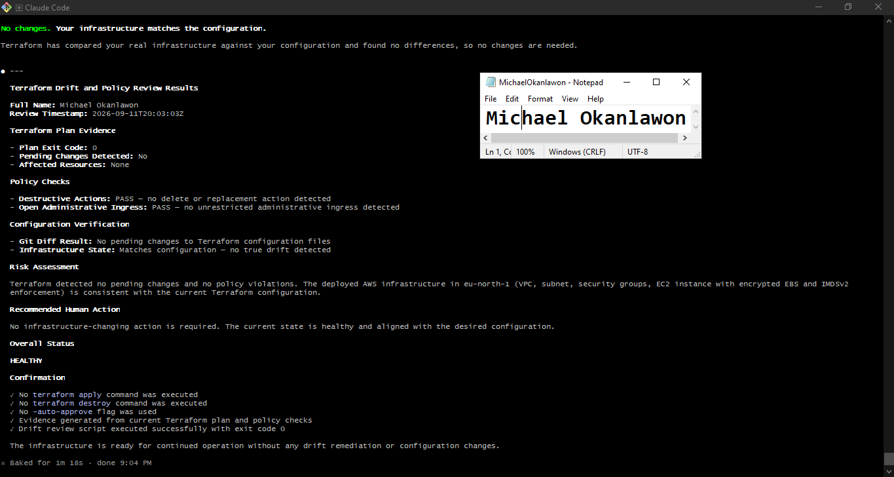
---

### Screenshot 18 — Saved Reports

Add a screenshot of `ls -lah reports` showing both:

- `drift-detected-report.txt`
- `resolved-report.txt`

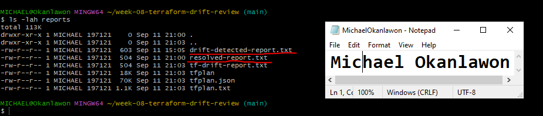

---

### Screenshot 19 — Drift Review Summary

Add a screenshot of `drift-review-summary.md` showing all required sections and your full name.

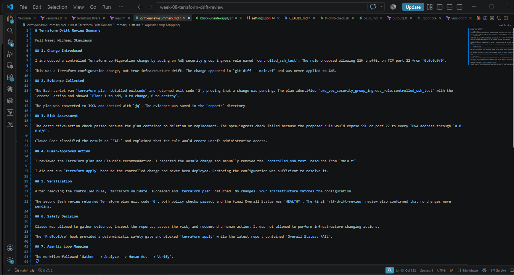

## Terraform Drift Review Summary

### 1. Change Introduced

Explain the controlled change you introduced.

State whether it was:

- True infrastructure drift, or
- A Terraform configuration change

I introduced a controlled Terraform configuration change by adding an AWS security group ingress rule named controlled_ssh_test. The rule proposed allowing SSH traffic on TCP port 22 from 0.0.0.0/0.

This was a Terraform configuration change, not true infrastructure drift. The change appeared in git diff -- main.tf and was never applied to AWS.

### 2. Evidence Collected

Describe the Terraform plan evidence and affected resource.

The Bash script ran terraform plan -detailed-exitcode, which returned exit code 2, confirming that a change was pending. The plan identified aws_vpc_security_group_ingress_rule.controlled_ssh_test with a create action and showed:

Plan: 1 to add, 0 to change, 0 to destroy.

The plan was converted to JSON for the jq policy checks, and the results were saved in reports/drift-detected-report.txt.

### 3. Risk Assessment

Explain the risk identified by the Bash check and Claude Code.

The destructive-action check passed because the plan contained no deletion or replacement. However, the open-ingress check failed because the proposed security rule would expose SSH port 22 to every IPv4 address through 0.0.0.0/0.

Claude Code confirmed that this would create unsafe administrative access and assigned an Overall Status of FAIL.

### 4. Human-Approved Action

Explain the action you reviewed and executed manually.

I reviewed the Terraform plan, Bash report, and Claude’s recommendation. I rejected the unsafe change and manually removed the controlled_ssh_test resource from main.tf.

I did not run terraform apply because the controlled rule had never been deployed. Restoring the configuration was sufficient to resolve the difference.

### 5. Verification

Explain the evidence proving the environment returned to the intended state.

After removing the controlled rule, terraform validate succeeded and terraform plan returned:

No changes. Your infrastructure matches the configuration.

The second Bash review returned plan exit code 0, both policy checks passed, and reports/resolved-report.txt recorded an Overall Status of HEALTHY. The final /tf-drift-review also confirmed that no changes were pending.

### 6. Safety Decision

Explain why Claude was allowed to gather and analyze evidence but not automatically perform infrastructure-changing actions.

Claude was allowed to gather Terraform plan evidence, inspect the reports, assess the risk, and recommend a human action because those activities were read-only.

Claude was not allowed to apply changes automatically because terraform apply could modify, expose, replace, or delete real infrastructure. The PreToolUse hook provided a deterministic safety gate and blocked the apply attempt while the latest report contained Overall Status: FAIL.

### 7. Agentic Loop Mapping

Explain how your workflow followed:

```text
Gather --> Analyze --> Human Act --> Verify
```

The workflow followed Gather --> Analyze --> Human Act --> Verify.

The Bash script gathered Terraform plan and policy evidence. Claude analyzed the affected resource and explained the security risk. I reviewed the recommendation and manually removed the unsafe configuration. Finally, the Bash script and Claude performed a second review that confirmed the environment had returned to a healthy and aligned state.

## Questions

### 1. What action did you execute to resolve the difference?

I manually removed the aws_vpc_security_group_ingress_rule.controlled_ssh_test resource from main.tf. No apply was required because the unsafe rule had never been deployed.

### 2. Did you review `terraform plan` before taking action?

Yes. I reviewed the plan and confirmed that it proposed creating one unrestricted SSH security rule, with no resource updates, deletions, or replacements.

### 3. What evidence proves the environment is now aligned?

The final Terraform plan displayed No changes, the plan exit code was 0, both Bash policy checks passed, and the final Bash and Claude reviews returned HEALTHY.

### 4. Why is a second drift review required after the fix?

A second review provides current evidence that the corrective action worked and confirms that no pending changes, destructive actions, or unsafe administrative ingress rules remain.

### 5. What could go wrong if an AI agent automatically applied every detected Terraform change?

The agent could expose administrative services, delete or replace resources, interrupt applications, increase costs, or deploy a change that does not match the operator’s intention.

### 6. In one sentence, explain the difference between asking an AI chatbot “Is my infrastructure okay?” and using this evidence-based Agentic AI workflow.

A general chatbot question relies on incomplete context, while this workflow uses current Terraform plan evidence, deterministic policy checks, AI-assisted analysis, human review, and final verification.

---

# LinkedIn Post — Mandatory

## Goal

Publish a LinkedIn post in your own words describing:

- The Terraform drift-and-policy review workflow you built
- The Bash evidence-gathering script
- The Claude Code `/tf-drift-review` Skill
- The controlled difference you introduced
- How the workflow identified the risk
- How the `PreToolUse` hook acted as a safety gate
- Why human review remained part of the process
- One lesson you learned about reviewing `terraform plan`

Include a screenshot of the detected change and a screenshot of the final `HEALTHY` review in your post.

Suggested tags:

```text
#DMIByPravinMishra #Terraform #AgenticAI #ClaudeCode #DevOps
```

## LinkedIn Evidence

### LinkedIn Post URL

`https://lnkd.in/p/eyu4dE7z`

### Published LinkedIn Post Screenshot — Mandatory

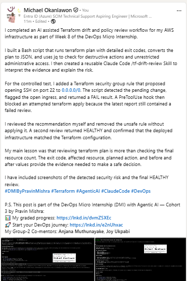

---

# Required Assignment Files

Confirm that the following files are included in your GitHub repository:

- `CLAUDE.md`
- `AI Assignment/tf-drift-check.sh`
- `.claude/skills/tf-drift-review/SKILL.md`
- `.claude/settings.json` containing the safety hook
- `reports/drift-detected-report.txt`
- `reports/resolved-report.txt`
- `drift-review-summary.md`

---

# Submission Instructions

- Complete Tasks 1–8 in sequence.
- Include Screenshots 1–19 exactly as specified.
- Answer every question under Tasks 1–8 in your own words.
- Complete all seven sections of the Terraform Drift Review Summary.
- Include the GitHub repository/folder URL containing the assignment files.
- Include your full name in the required reports and screenshots.
- Include the LinkedIn post URL and a screenshot of the published LinkedIn post.
- Do not expose access keys, passwords, tokens, account IDs, private keys, Terraform secrets, or other sensitive information.
- Review all screenshots carefully and hide or redact sensitive details where necessary.

---

# Completion Checklist

- [ ] Confirmed a clean Terraform baseline
- [ ] Created the required assignment workspace
- [ ] Created or updated `CLAUDE.md`
- [ ] Added project context and safety rules
- [ ] Created `tf-drift-check.sh`
- [ ] Added my full name to the report
- [ ] Validated the Bash script
- [ ] Made the script executable
- [ ] Used `terraform plan -detailed-exitcode`
- [ ] Used Terraform plan JSON
- [ ] Used `jq` to inspect destructive actions
- [ ] Used `jq` to inspect unsafe ingress
- [ ] Confirmed the baseline returns `HEALTHY`
- [ ] Created `/tf-drift-review`
- [ ] Restricted the Skill to appropriate tools
- [ ] Confirmed the Skill remains read-only
- [ ] Confirmed the Skill never runs `terraform apply`
- [ ] Confirmed the Skill never runs `terraform destroy`
- [ ] Introduced a controlled detectable difference
- [ ] Correctly identified whether it was true drift or a configuration change
- [ ] Saved `drift-detected-report.txt`
- [ ] Added the `PreToolUse` safety hook
- [ ] Verified the hook blocks `terraform apply` when the report is `FAIL`
- [ ] Reviewed the Terraform evidence before resolving the change
- [ ] Performed any infrastructure-changing action manually
- [ ] Ran the drift review again after resolution
- [ ] Confirmed the final status is `HEALTHY`
- [ ] Saved `resolved-report.txt`
- [ ] Completed `drift-review-summary.md`
- [ ] Mapped the workflow to `Gather --> Analyze --> Human Act --> Verify`
- [ ] Included all 19 numbered screenshots
- [ ] Answered all required questions
- [ ] Published the required LinkedIn post
- [ ] Added the LinkedIn post URL and screenshot
- [ ] Included the GitHub repository/folder URL
- [ ] Confirmed that no sensitive information is exposed

---

*This submission is part of the DevOps Micro Internship (DMI) Cohort 3 — Agentic AI Track.*
